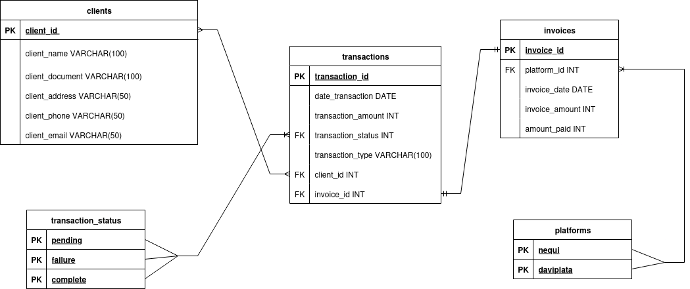

# ExpertSoft 

## Description

This project provides a super simple Express.js API designed for beginners, demonstrating basic CRUD (Create, Read, Update, Delete) operations for client management and offering advanced query endpoints for financial data analysis. It interacts directly with a MySQL database, focusing on core functionalities without complex architectural layers.

## How to Run the Project

Follow these steps to set up and run the project locally:

1.  **Clone the repository:**
    ```bash
    git clone <repository_url>
    cd expertsoft-basic
    ```

2.  **Install Backend Dependencies:**
    Navigate to the `backend` directory and install the necessary Node.js packages:
    ```bash
    cd backend
    npm install
    cd ..
    ```

3.  **Database Setup:**
    *   Ensure you have a MySQL server running.
    *   Create a database (e.g., `bd6vf7oy4ftjd9jiw1o3`).
    *   Execute the SQL commands from `ddl.sql` in your MySQL client to create the necessary tables and seed initial data (platforms and transaction statuses).

4.  **Configure Environment Variables:**
    *   Create a `.env` file in the `backend` directory (you can copy `.env.example`).
    *   Fill in your MySQL connection details:
        ```
        MYSQL_HOST=your_mysql_host
        MYSQL_PORT=your_mysql_port
        MYSQL_USER=your_mysql_user
        MYSQL_PASSWORD=your_mysql_password
        MYSQL_DB=your_mysql_database
        PORT=3000
        ```

5.  **Bulk Load Data from CSV Files:**
    It's crucial to import the CSV files in the correct order to satisfy foreign key constraints. Ensure your database is clean (re-run `ddl.sql` if necessary) before proceeding.

    *   **Import Clients:**
        ```bash
        node backend/importCsv_flexible.js backend/data/clients.csv
        ```
    *   **Import Platforms:**
        ```bash
        node backend/importCsv_flexible.js backend/data/platforms.csv
        ```
    *   **Import Invoices:**
        ```bash
        node backend/importCsv_flexible.js backend/data/invoices.csv
        ```
    *   **Import Transactions:**
        ```bash
        node backend/importCsv.js
        ```

6.  **Start the API Server:**
    From the `backend` directory, run the API server:
    ```bash
    cd backend
    npm run dev
    ```
    The API will be accessible at `http://localhost:3000` (or your configured PORT).

## Technologies Used

*   **Node.js:** JavaScript runtime environment.
*   **Express.js:** Fast, unopinionated, minimalist web framework for Node.js.
*   **MySQL:** Relational database management system.
*   **`mysql2/promise`:** MySQL client for Node.js with Promise support.
*   **`dotenv`:** Loads environment variables from a `.env` file.
*   **`multer`:** Node.js middleware for handling `multipart/form-data`, primarily used for file uploads.
*   **`csv-parse`:** A CSV parser for Node.js.

## Data Normalization Explanation

The database schema is designed with normalization principles to ensure data integrity, reduce redundancy, and improve data management efficiency. Key entities are separated into distinct tables with defined relationships:

*   **`clients`:** Stores unique client information (full name, email, phone, document ID).
*   **`platforms`:** Stores unique payment platform names (e.g., Nequi, Daviplata).
*   **`transaction_status`:** Stores possible statuses for transactions (e.g., pending, complete, failure).
*   **`invoices`:** Stores invoice details, linked to `clients` (who the invoice is for) and `platforms` (through which platform the invoice might be paid).
*   **`transactions`:** Stores individual transaction records, linked to `clients`, `invoices`, and `transaction_status`. Each transaction has an `external_ref` for unique identification from external systems.

Relationships are established using foreign keys, ensuring that related data remains consistent (e.g., a transaction must be linked to an existing client and invoice).

## Advanced Queries Explanation

The API provides three advanced query endpoints to extract meaningful insights from the financial data:

1.  **Total Paid by Each Client (`GET /api/queries/total-paid-by-client`)**
    *   **Description:** Calculates the sum of all transaction amounts for each client.
    *   **Purpose:** Helps administrators track total revenue generated per client and monitor overall income.
    *   **Logic:** Joins `clients` with `transactions` on `client_id` and sums `transaction_amount`, grouped by client.

2.  **Pending Invoices with Client and Transaction Info (`GET /api/queries/pending-invoices`)**
    *   **Description:** Identifies invoices that have not been fully paid, showing the remaining amount, along with the associated client's name.
    *   **Purpose:** Essential for financial managers to track outstanding payments, manage collections, and follow up with clients.
    *   **Logic:** Joins `invoices` with `clients` and `transactions`. It calculates the `paid_amount` by summing `transaction_amount` for each invoice and then determines `pending_amount` (`invoice_amount - paid_amount`). Filters for invoices where `pending_amount` is greater than zero.

3.  **Transactions by Platform (`GET /api/queries/transactions-by-platform/:platform`)**
    *   **Description:** Retrieves a list of all transactions made through a specified payment platform (e.g., `Nequi`, `Daviplata`).
    *   **Purpose:** Allows analysts to review transaction activity per platform, useful for reconciliation, performance analysis, or identifying trends.
    *   **Logic:** Joins `transactions` with `invoices`, `platforms`, and `clients`. Filters transactions by `platform.name` (provided as a URL parameter) and orders them by date.

## Relational Model



## Developer Data

*   **Name:** Emmanuel Pérez Martínez
*   **Clan:** Berners Lee
*   **Email:** emmanuelperezm123@gmail.com

## POSTMAN Collection

* https://srfrancklo0309.postman.co/workspace/My-Workspace~dae4b4ab-cf5e-4644-803a-1d8248f6465d/collection/46756324-0988217a-fc93-45d5-857d-4f258a88b023?action=share&source=copy-link&creator=46756324